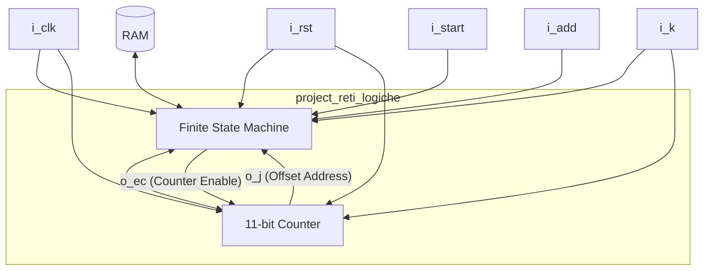

# Progetto Reti Logiche (A.A. 2023-2024)

**Studenti:** Lorenzo Meroi & Giuseppe Laguardia  
**Docente:** Fabio Salice  
**Valutazione Finale:** `25 / 30`  
**Documentazione Completa:** [Report Reti Logiche.pdf](file:///C:/Users/loisu/Desktop/scuola/universita/github_fix/prova-finale-reti-logiche-2023-2024/Report%20Reti%20Logiche.pdf)

---

## 🇬🇧 English Version

### Project Overview
This repository contains the hardware implementation of a digital module designed for the **Final Project of Logical Networks (Prova Finale di Reti Logiche)** at **Politecnico di Milano** (A.Y. 2023-2024).

The project involves implementing a synchronous hardware module in VHDL that interfaces with a single-port RAM. The module processes a sequence of memory words, updates their values according to specific rules, and computes a **Credibility Value** ($C$) for each word, writing the results back to the memory.

---

### Assignment Description
The module is required to read a sequence of $K$ words starting from a base memory address $ADD$.
* **Memory Structure:**
  * The actual value of each word $W$ is located at even offsets: $ADD, ADD+2, ADD+4, \dots, ADD+2(K-1)$.
  * The odd offsets: $ADD+1, ADD+3, ADD+5, \dots, ADD+2(K-1)+1$ are reserved for the **Credibility** value $C$ (initially set to `0`).
* **Processing Rules:**
  1. **Replacement of Zero Values:** If a word $W$ is `0` (signifying "value not specified"), it must be replaced in memory by the **last non-zero value** read in the sequence.
  2. **First Word Edge Case:** If the sequence starts with one or more `0` values, these values are **not** replaced, and their associated credibility remains `0` until the first non-zero word is encountered.
  3. **Credibility Calculation ($C$):**
     * Whenever a read word is non-zero, its credibility $C$ is set to **`31`**.
     * If the read word is `0` (and is not at the start before the first non-zero word), its credibility $C$ is calculated by **decrementing** the credibility of the previous word by `1` ($C = C_{prev} - 1$).
     * The credibility value cannot go below `0` (once it reaches `0`, it remains `0`).
* **System Constraints:**
  * Fully synchronous design driven by the rising edge of the clock signal (`i_clk` with a period of `20 ns`, 50% duty cycle).
  * Asynchronous active-high reset signal (`i_rst`).

#### Module Interface (Signals)
* **Inputs:**
  * `i_clk`: Clock signal (1 bit).
  * `i_rst`: Asynchronous reset signal (1 bit).
  * `i_start`: Activation signal (1 bit).
  * `i_add`: Starting memory address of the sequence (16 bits).
  * `i_k`: Number of words to process (10 bits).
  * `i_mem_data`: 8-bit data bus from memory (read data).
* **Outputs:**
  * `o_done`: Execution completion flag (1 bit).
  * `o_mem_addr`: Memory address bus (16 bits).
  * `o_mem_data`: 8-bit data bus to memory (write data).
  * `o_mem_we`: Write enable signal (1 bit: `1` for write, `0` for read).
  * `o_mem_en`: Memory activation enable signal (1 bit).

---

### Architecture & Design
The architecture is structured into two main interacting components inside the top-level entity [project_reti_logiche.vhd](file:///C:/Users/loisu/Desktop/scuola/universita/github_fix/prova-finale-reti-logiche-2023-2024/progetto/componenti/project_reti_logiche.vhd):

1. **Finite State Machine (FSM):** Controls the overall operational flow, communicating with the RAM, reading values, managing arithmetic operations for the credibility value, writing results back, and coordinating the finish state. See the implementation in [fsm.vhd](file:///C:/Users/loisu/Desktop/scuola/universita/github_fix/prova-finale-reti-logiche-2023-2024/progetto/componenti/fsm.vhd).
2. **Counter:** An 11-bit counter that manages the memory offset relative to the base address `i_add`. It guarantees that the module processes exactly $K$ words, counting up to $2 \times K_{MAX}$. See the implementation in [contatore.vhd](file:///C:/Users/loisu/Desktop/scuola/universita/github_fix/prova-finale-reti-logiche-2023-2024/progetto/componenti/contatore.vhd).

*The entire design is also provided as a single merged file: [107881126_10773518.vhd](file:///C:/Users/loisu/Desktop/scuola/universita/github_fix/prova-finale-reti-logiche-2023-2024/progetto/107881126_10773518.vhd).*

#### FSM States (9-State Model)
* `RESET` (RST): Awaiting the activation signal (`i_start = '1'`).
* `START`: Entry state to start processing a word. Checks if the counter offset $j = 2 \times K$. If yes, it transitions to the completion phase (`DONE_UP`). Otherwise, it initiates a memory read for the value of the current word $W$.
* `READ_VALUE` (RD_VAL): Evaluates the byte read from memory.
  * If non-zero, sets credibility to `31` and moves to the next word.
  * If `0` and it is the first word of the sequence ($j = 0$), it leaves the value as `0`, sets credibility to `0`, and proceeds.
  * If `0` at subsequent positions, it triggers a read of the previous word's credibility.
* `NEXT_WORD` (NXT_WRD): Triggers the Counter increment to point to the next address offset.
* `READ_PREVIOUS_CREDIBILITY` (RD_PRE_C): Evaluates the credibility of the previous word.
  * If the previous credibility is `0`, the current credibility remains `0`.
  * If it is greater than `0`, it decrements it by `1` and schedules a read of the last valid value.
* `READ_PREVIOUS_VALUE` (RD_PRE_V): Reads the last non-zero value stored in the FSM registers.
* `WRITE_PREVIOUS_VALUE` (WR_PRE_V): Overwrites the zero value in memory with the retrieved last valid non-zero value.
* `DONE_UP`: Asserts the `o_done = '1'` signal and waits for `i_start` to go low.
* `DONE_DOWN` (DONE_DW): Resets `o_done = '0'`. If `i_start = '0'`, transitions back to `RESET`; if `i_start = '1'`, restarts a new computation block directly.

---

### Synthesis & Experimental Results
The hardware design was synthesized and implemented using **Xilinx Vivado** targeting the **FPGA xc7a200tfbg484-1** board.

#### Resource Utilization
| Resource | Used | Available | Utilization % |
| :--- | :--- | :--- | :--- |
| **LUT as Logic** | 139 | 134,600 | 0.10 % |
| **Flip-Flops (FF)** | 14 | 269,200 | < 0.01 % |

Special design care was taken during coding to avoid the creation of unwanted latches, guaranteeing a fully synchronous execution path and high reliability.

#### Timing Constraints
* **Required Clock Period:** `20.0 ns` (50 MHz)
* **Actual Slack Time:** `15.880 ns` (The design is highly optimized and easily meets timing constraints).

---

### Testing & Simulation
Validation was performed on a massive scale through several steps:
1. **Standard Testbench:** Run using the initial professor-provided test configurations.
2. **Automated Random Scenarios:** A Python-based script [test_bench_generator.py](file:///C:/Users/loisu/Desktop/scuola/universita/github_fix/prova-finale-reti-logiche-2023-2024/testing/test_bench_generator.py) was built to generate **1000 random test cases**, varying:
   * Sequence length $K$ (from 0 to 1023).
   * Values of word $W$ (randomly distributed between 0 and 255).
3. **Simulation Automation:** A bot script [test_bench_bot.py](file:///C:/Users/loisu/Desktop/scuola/universita/github_fix/prova-finale-reti-logiche-2023-2024/testing/test_bench_bot.py) was written using PyAutoGUI to launch post-synthesis functional simulations automatically inside the Vivado TCL terminal environment.
4. **Edge Cases Checked:**
   * Sequences containing all-zero values.
   * Multiple consecutive, back-to-back sequences.
   * Asynchronous reset triggered mid-execution.
   * Sequence opening with zero values.
   * Decrementing credibility to zero and holding it (e.g. sequences with a non-zero value followed by more than 31 zeros).

---

## 🇮🇹 Versione Italiana

### Descrizione del Progetto
Questa repository contiene l'implementazione hardware di un modulo digitale progettato per la **Prova Finale di Reti Logiche** presso il **Politecnico di Milano** (A.A. 2023-2024).

Il progetto richiede lo sviluppo in VHDL di un modulo hardware sincrono che si interfacci con una RAM a porta singola. Il modulo legge una sequenza di parole, ne aggiorna il valore secondo regole predefinite e calcola il **Valore di Credibilità** ($C$) associato a ciascun elemento, riscrivendo i risultati finali in memoria.

---

### Specifica dei Requisiti
Il modulo legge una sequenza di $K$ parole a partire da un indirizzo base $ADD$.
* **Struttura della Memoria:**
  * I dati $W$ della sequenza si trovano agli indirizzi pari: $ADD, ADD+2, ADD+4, \dots, ADD+2(K-1)$.
  * Gli indirizzi dispari: $ADD+1, ADD+3, ADD+5, \dots, ADD+2(K-1)+1$ sono dedicati a contenere la **Credibilità** $C$ calcolata (inizialmente pari a `0`).
* **Regole di Elaborazione:**
  1. **Sostituzione dei valori nulli:** Se una parola $W$ è pari a `0` ("valore non specificato"), questo deve essere sostituito in memoria con l'**ultimo valore non nullo** letto nella sequenza.
  2. **Caso limite iniziale:** Se la sequenza inizia con uno o più valori nulli (`0`), questi **non** vengono sostituiti e la loro credibilità rimane `0` finché non si incontra la prima parola diversa da zero.
  3. **Calcolo della Credibilità ($C$):**
     * Quando il dato letto non è nullo, la sua credibilità $C$ viene impostata a **`31`**.
     * Se il dato letto è nullo, la credibilità $C$ viene calcolata **decrementando di uno** quella della parola precedente ($C = C_{prec} - 1$).
     * Il valore di credibilità non può scendere sotto lo zero (una volta raggiunto lo `0`, rimane costante).
* **Vincoli di Sistema:**
  * Tutti i segnali sono sincroni sul fronte di salita del clock (`i_clk` con periodo di `20 ns`, duty cycle 50%).
  * L'unico segnale asincrono è il reset attivo alto (`i_rst`).

#### Interfaccia del Modulo (Segnali)
* **Ingressi:**
  * `i_clk`: Segnale di clock (1 bit).
  * `i_rst`: Reset asincrono (1 bit).
  * `i_start`: Segnale di inizio elaborazione (1 bit).
  * `i_add`: Indirizzo di partenza in memoria (16 bit).
  * `i_k`: Numero di parole da analizzare (10 bit).
  * `i_mem_data`: Bus dati in ingresso dalla memoria (8 bit).
* **Uscite:**
  * `o_done`: Segnale di fine elaborazione (1 bit).
  * `o_mem_addr`: Bus indirizzi inviati alla memoria (16 bit).
  * `o_mem_data`: Bus dati da scrivere in memoria (8 bit).
  * `o_mem_we`: Write Enable per la memoria (`1` per scrivere, `0` per leggere).
  * `o_mem_en`: Segnale di enable per comunicare con la memoria (1 bit).

---

### Architettura e Implementazione
La struttura interna del componente [project_reti_logiche.vhd](file:///C:/Users/loisu/Desktop/scuola/universita/github_fix/prova-finale-reti-logiche-2023-2024/progetto/componenti/project_reti_logiche.vhd) è divisa in due blocchi principali:

1. **Macchina a Stati Finiti (FSM):** Gestisce l'intera logica di controllo, le letture/scritture in memoria RAM, l'algebra per il decremento della credibilità e la generazione delle uscite. Maggiori dettagli in [fsm.vhd](file:///C:/Users/loisu/Desktop/scuola/universita/github_fix/prova-finale-reti-logiche-2023-2024/progetto/componenti/fsm.vhd).
2. **Contatore:** Un contatore ad 11 bit che calcola l'offset di memoria a partire dall'indirizzo base `i_add`, assicurandosi di non superare le $K$ parole totali (fino a $2 \times K_{MAX}$). Maggiori dettagli in [contatore.vhd](file:///C:/Users/loisu/Desktop/scuola/universita/github_fix/prova-finale-reti-logiche-2023-2024/progetto/componenti/contatore.vhd).

*L'intero design è inoltre disponibile come file unico: [107881126_10773518.vhd](file:///C:/Users/loisu/Desktop/scuola/universita/github_fix/prova-finale-reti-logiche-2023-2024/progetto/107881126_10773518.vhd).*

#### Stati della FSM (9 stati)
* `RESET` (RST): Stato di attesa del segnale di avvio (`i_start = '1'`).
* `START`: Inizio elaborazione di una parola. Se l'offset del contatore $j = 2 \times K$, la computazione è finita e si va a `DONE_UP`. Altrimenti, si richiede la lettura del dato $W$.
* `READ_VALUE` (RD_VAL): Analizza il byte letto:
  * Se non nullo, imposta la credibilità a `31` e passa alla parola successiva.
  * Se nullo e siamo al primo elemento ($j = 0$), lascia il valore a `0` con credibilità `0`.
  * Se nullo in posizioni successive, richiede la lettura della credibilità del dato precedente.
* `NEXT_WORD` (NXT_WRD): Abilita il contatore per passare all'indirizzo successivo.
* `READ_PREVIOUS_CREDIBILITY` (RD_PRE_C): Analizza la credibilità precedente:
  * Se era `0`, la credibilità attuale rimane `0`.
  * Se era $>0$, viene decrementata di `1` e si passa a leggere l'ultimo valore non nullo.
* `READ_PREVIOUS_VALUE` (RD_PRE_V): Legge dai registri interni l'ultimo valore non nullo registrato.
* `WRITE_PREVIOUS_VALUE` (WR_PRE_V): Sovrascrive in memoria il valore nullo corrente con l'ultimo valore valido recuperato.
* `DONE_UP`: Porta a alto il segnale `o_done = '1'` e attende che `i_start` ritorni basso.
* `DONE_DOWN` (DONE_DW): Abbassa il segnale `o_done`. Se `i_start` è a `0` si torna a `RESET`, se `i_start` è a `1` ricomincia subito una nuova elaborazione.

---

### Risultati della Sintesi
Il codice è stato sintetizzato e implementato in ambiente **Xilinx Vivado** puntando alla scheda **FPGA xc7a200tfbg484-1**.

#### Utilizzo delle Risorse
| Risorsa | Utilizzata | Disponibile | % Utilizzo |
| :--- | :--- | :--- | :--- |
| **LUT as Logic** | 139 | 134.600 | 0.10 % |
| **Flip-Flops (FF)** | 14 | 269.200 | < 0.01 % |

È stata prestata massima attenzione per evitare la generazione involontaria di latch, assicurando un design sincrono pulito e privo di comportamenti instabili.

#### Tempistiche (Timing)
* **Periodo di Clock richiesto:** `20.0 ns` (50 MHz)
* **Slack Time calcolato:** `15.880 ns` (Ampiamente entro i limiti richiesti).

---

### Simulazioni e Test
Il corretto funzionamento del modulo hardware è stato validato tramite diverse fasi di test:
1. **Testbench Standard:** Fornito dai docenti del corso.
2. **Generatore di Scenari Casuali:** Implementato uno script Python [test_bench_generator.py](file:///C:/Users/loisu/Desktop/scuola/universita/github_fix/prova-finale-reti-logiche-2023-2024/testing/test_bench_generator.py) per produrre **1000 casi di test casuali** variando la lunghezza della sequenza $K$ (da 0 a 1023) e i valori delle parole (da 0 a 255).
3. **Automazione Vivado:** Uno script [test_bench_bot.py](file:///C:/Users/loisu/Desktop/scuola/universita/github_fix/prova-finale-reti-logiche-2023-2024/testing/test_bench_bot.py) basato su PyAutoGUI automatizza il lancio delle simulazioni post-sintesi tramite interfaccia TCL di Vivado.
4. **Casi Limite Analizzati (Edge Cases):**
   * Sequenze interamente composte da zeri.
   * Esecuzioni multiple di sequenze successive.
   * Segnale di RESET asincrono inviato durante l'elaborazione.
   * Sequenza che comincia con valore zero.
   * Decadimento della credibilità fino a zero e mantenimento del valore nullo.
